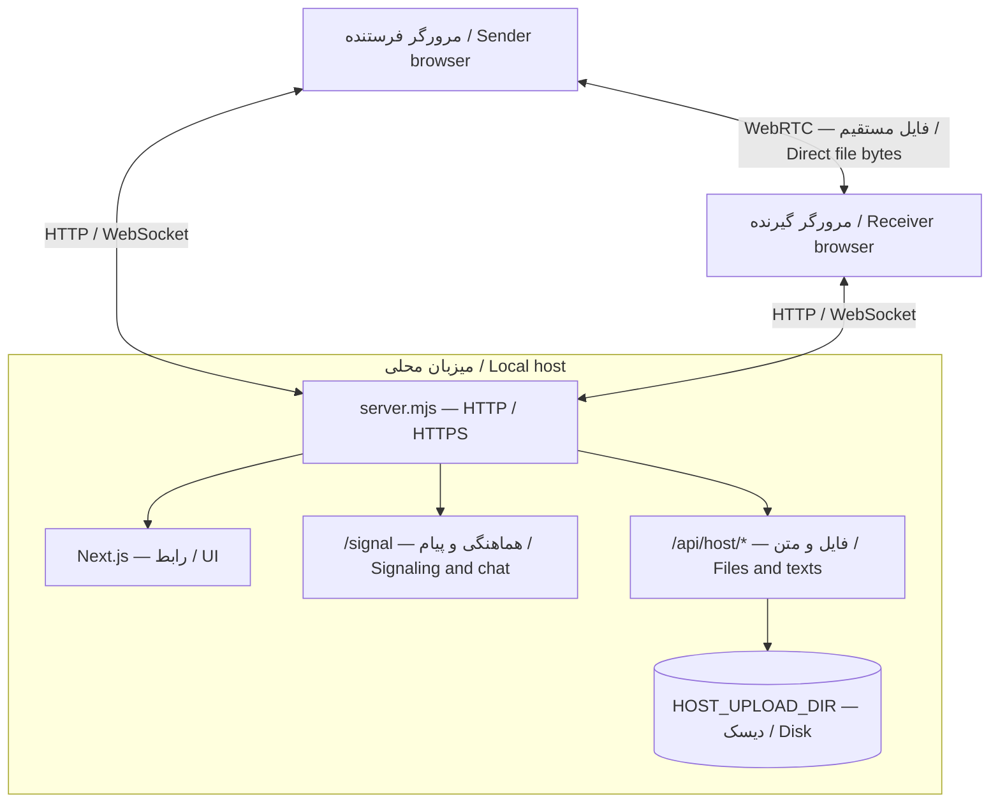

<div align="center">

<h1>Hamras</h1>

<p><strong>فایل‌ها اینجا، فاصله‌ها هیچ.</strong><br>Local files. Direct connections.</p>

<p>انتقال فایل، پیام مستقیم و فضای اشتراکی روی میزبان در شبکهٔ محلی<br>Peer-to-peer file transfers, direct messages, and host storage for your local network</p>

<p><code>Next.js</code> · <code>React</code> · <code>TypeScript</code> · <code>WebRTC</code> · <code>WebSocket</code></p>

<p><a href="#persian">راهنمای فارسی</a> · <a href="#english">English guide</a> · <a href="#architecture-map">معماری / Architecture</a> · <a href="#project-tree">ساختار / Project structure</a></p>

</div>

---

<a id="persian"></a>

<div dir="rtl">

## راهنمای فارسی

**هم‌رس** یک برنامهٔ خودمیزبان برای جابه‌جایی فایل و متن میان دستگاه‌های یک شبکهٔ محلی مورداعتماد است. برنامه را روی یک میزبان اجرا کنید و صفحهٔ آن را روی دستگاه‌های دیگر باز کنید؛ نصب برنامهٔ بومی روی دستگاه‌های کاربر لازم نیست.

این پروژه دو مسیر متفاوت دارد: **انتقال مستقیم فایل بین مرورگرها** و **نگهداری فایل و متن روی میزبان**. پیام‌های مستقیم نیز از مسیر WebSocket میزبان عبور می‌کنند، اما در آن ذخیره نمی‌شوند.

> **مرز اعتماد:** این برنامه برای استفاده در شبکهٔ محلی مورداعتماد طراحی شده است، نه به‌عنوان سرویس اشتراک فایل عمومی اینترنتی. فایل‌ها و متن‌های ذخیره‌شده روی میزبان برای هر کسی که بتواند به سرویس دسترسی پیدا کند قابل خواندن‌اند.

**فهرست:** [امکانات](#fa-features) · [پیش‌نیازها](#fa-requirements) · [راه‌اندازی](#fa-start) · [تنظیمات](#fa-config) · [HTTPS و پروکسی](#fa-network) · [نحوهٔ استفاده](#fa-usage) · [معماری](#fa-architecture) · [محدودیت‌ها](#fa-limits) · [API](#fa-api) · [ذخیره‌سازی](#fa-storage) · [تست‌ها](#fa-tests) · [امنیت](#fa-security) · [عیب‌یابی](#fa-troubleshooting) · [مشارکت و اعتبارها](#fa-contributing)

<a id="fa-features"></a>

### امکانات

| قابلیت | رفتار |
| :--- | :--- |
| انتقال مستقیم فایل | ارسال از مرورگر فرستنده به مرورگر گیرنده با WebRTC DataChannel، پس از تأیید گیرنده |
| شناسایی دستگاه‌های حاضر | نمایش مرورگرهای متصل به همان سرور و امکان تغییر نام نمایشی |
| ذخیرهٔ مستقیم روی دیسک | دریافت تدریجی فایل در مرورگر دارای API مناسب و بافت امن |
| دریافت در حافظه | مسیر جایگزین برای فایل‌های کوچک در صورت نبود API ذخیرهٔ مستقیم |
| وضعیت انتقال | پیشرفت، سرعت، لغو، خطای ارتباط و مرحلهٔ نهایی‌سازی |
| پیام مستقیم | ارسال متن فقط به دستگاه انتخاب‌شده، با تأیید رلهٔ سرور و امکان کپی |
| کتابخانهٔ فایل میزبان | آپلود، فهرست، دانلود، حذف و مشاهدهٔ انواع مجاز |
| متن‌های ماندگار | ذخیره، خواندن، کپی و حذف یادداشت‌های عمومی روی میزبان |
| کنترل نوشتن | رمز مشترک برای آپلود، حذف و مدیریت متن‌ها، با محدودیت تلاش بر اساس IP |
| رابط فارسی | راست‌به‌چپ، فونت Vazirmatn، طراحی واکنش‌گرا و پشتیبانی از کاهش حرکت |

**کدام مسیر مناسب است؟**

| مسیر | محل عبور محتوا | ماندگاری | دسترسی |
| :--- | :--- | :--- | :--- |
| فایل مستقیم | WebRTC بین مرورگرها | روی مقصد؛ نه روی سرور | نیازمند پذیرش گیرنده |
| پیام مستقیم | رلهٔ WebSocket سرور | موقت در صفحهٔ مرورگر | فقط دستگاه انتخاب‌شده؛ سرور متن را هنگام رله می‌بیند |
| فایل روی میزبان | HTTP/HTTPS به دیسک سرور | پس از راه‌اندازی مجدد هم باقی می‌ماند | خواندن بدون رمز؛ نوشتن و حذف با رمز |
| متن روی میزبان | HTTP/HTTPS به فایل JSON | پس از راه‌اندازی مجدد هم باقی می‌ماند | خواندن بدون رمز؛ نوشتن و حذف با رمز |

<a id="fa-requirements"></a>

### پیش‌نیازها و فناوری‌ها

- روی **میزبان**: Node.js با نسخهٔ مطابق شرط `>=22.0.0` در `package.json`، ابزار npm و فضای دیسک کافی.
- روی **کاربر**: مرورگر دارای WebRTC و WebSocket و دسترسی شبکه به میزبان.
- برای **دریافت مستقیم روی دیسک**: بافت امن و وجود `showSaveFilePicker`؛ راهنمای برنامه Chrome یا Edge دسکتاپ را پیشنهاد می‌کند. تشخیص واقعی در زمان اجرا انجام می‌شود، نه صرفاً با نام مرورگر.
- نصب وابستگی‌ها و مرورگر تست به دریافت بسته‌ها نیاز دارد. مسیر انتقال فایل در برنامه، STUN یا TURN خارجی پیکربندی نکرده است.

نسخه‌های زیر **محدوده‌های ثبت‌شده در پروژه** هستند، نه ادعای آخرین نسخهٔ منتشرشده:

| بخش | وابستگی |
| :--- | :--- |
| رابط و مسیریابی | Next.js `^16.3.5` با App Router؛ React و React DOM `^19.3.0` |
| سیگنالینگ و پیام | `ws` با محدودهٔ `^8.21.3` |
| تایپ‌ها | TypeScript `^6.0.3` |
| کیفیت کد | ESLint `^9.39.5` و `eslint-config-next` |
| تست مرورگر | Playwright `^1.63.0` |
| فونت | `@fontsource/vazirmatn` با محدودهٔ `^5.3.0` |

<a id="fa-start"></a>

### راه‌اندازی سریع

#### ۱. نصب وابستگی‌ها

کد ریپو را دریافت کنید و ترمینال را در پوشه‌ای باز کنید که `package.json` و `server.mjs` در آن قرار دارند:

```bash
npm ci
```

#### ۲. ساخت تنظیمات محلی

اگر `.env` ندارید، از `.env.example` کپی بگیرید. اگر فایل از قبل وجود دارد، همان را ویرایش کنید و روی تنظیمات خود بازنویسی نکنید.

Linux / macOS:

```bash
cp -n .env.example .env
```

PowerShell:

```powershell
if (-not (Test-Path .env)) { Copy-Item .env.example .env }
```

در فایل `.env`:

- برای `HOST_UPLOAD_PASSWORD` یک رمز طولانی، تصادفی و اختصاصی قرار دهید؛ مقدار خالی برای اجرای سرور قابل قبول نیست.
- `HOST_UPLOAD_DIR=uploads` و `HOST_PASSWORD_RETRY_SECONDS=60` را برای شروع نگه دارید.
- `ALLOW_ALL` را خالی بگذارید تا گارد پیش‌فرض شبکه فعال بماند.
- هیچ رمز واقعی، فایل `.env` یا کلید TLS را در ریپوی عمومی منتشر نکنید.

#### ۳. اجرای توسعه

```bash
npm run dev
```

آدرس مناسب میزبان در ترمینال چاپ می‌شود. روی دستگاه‌های دیگر، **آدرس LAN میزبان** را باز کنید؛ `localhost` روی هر دستگاه به همان دستگاه اشاره دارد، نه رایانه‌ای که سرور را اجرا کرده است.

#### ۴. اجرای نسخهٔ ساخته‌شده

```bash
npm run build
npm start
```

> از اسکریپت‌های همین پروژه استفاده کنید. اجرای صرف `next dev` یا `next start` جای سرور سفارشی را نمی‌گیرد و مسیرهای `/signal` و `/api/host/*` را راه‌اندازی نمی‌کند. میزبان باید یک فرایند Node.js ماندگار با پشتیبانی WebSocket و دیسک قابل‌نوشتن داشته باشد؛ خروجی استاتیک به‌تنهایی کافی نیست.

<a id="fa-config"></a>

### تنظیمات محیط

سرور `.env` ریشهٔ پروژه را با `process.loadEnvFile()` می‌خواند. **مقادیر از قبل موجود در محیط فرایند، بر مقادیر فایل مقدم‌اند.** نبود فایل مجاز است، به شرط تأمین تنظیمات لازم از محیط. پس از تغییر تنظیمات، سرور را دوباره اجرا کنید.

| متغیر | پیش‌فرض کد | کاربرد |
| :--- | :--- | :--- |
| `PORT` | `3000` | پورت HTTP یا HTTPS؛ عدد صحیح معتبر |
| `HOST` | `0.0.0.0` | آدرس گوش‌دادن سرور |
| `LAN_HOSTS` | خالی | نام‌های میزبان مجاز اضافی، جداشده با کاما؛ بدون scheme و پورت |
| `ALLOW_ALL` | خاموش | مقدار `1` بررسی Host و آدرس خصوصی را غیرفعال می‌کند؛ برای رفع خطا به‌صورت پیش‌فرض فعالش نکنید |
| `HOST_UPLOAD_PASSWORD` | **اجباری؛ بدون پیش‌فرض** | رمز مشترک عملیات نوشتن و حذف؛ نباید خالی یا چندخطی باشد |
| `HOST_PASSWORD_RETRY_SECONDS` | `60` | مدت قفل پس از یک رمز اشتباه؛ عدد صحیح مثبت بر حسب ثانیه |
| `HOST_UPLOAD_DIR` | `uploads` | پوشهٔ داده؛ مسیر نسبی از ریشهٔ پروژه محاسبه می‌شود؛ مسیر مطلق هم پذیرفته می‌شود |
| `TLS_CERT_FILE` | تنظیم نشده | مسیر فایل گواهی TLS؛ باید همراه کلید تنظیم شود |
| `TLS_KEY_FILE` | تنظیم نشده | مسیر فایل کلید TLS؛ باید همراه گواهی تنظیم شود |
| `HOST_MAX_FILE_SIZE` | `4 GiB` | سقف هر فایل در سمت سرور، بر حسب بایت |
| `HOST_MAX_TOTAL_SIZE` | `20 GiB` | سقف حجم کتابخانهٔ فایل در سمت سرور، بر حسب بایت |
| `HOST_MAX_MESSAGES` | `200` | سقف تعداد متن‌های ذخیره‌شده |

نکات مهم:

- مقدارهای غایب `HOST_UPLOAD_DIR` و زمان تلاش، پیش‌فرض دارند؛ مقدار خالیِ صریح برای آن‌ها خطای تنظیمات محسوب می‌شود.
- برای سقف‌های اختیاری از اعداد مثبت معتبر استفاده کنید؛ این گزینه‌ها همان اعتبارسنجی سخت‌گیرانهٔ زمان تلاش را ندارند.
- مقدار کامنت‌شدهٔ `HOST_MAX_TOTAL_SIZE` در `.env.example` یک **نمونهٔ تنظیم** است؛ پیش‌فرض اجرایی کد همچنان `20 GiB` است.
- سقف آپلود رابط کاربری از `MAX_HOST_FILE_SIZE` در `src/lib/protocol.mjs` می‌آید. افزایش متغیر محیطی سمت سرور به‌تنهایی سقف رابط کاربری را افزایش نمی‌دهد.
- `HOST_UPLOAD_DIR` مستقل از پوشهٔ اجرای فرایند حل می‌شود؛ مسیر نسبی فایل‌های TLS مستقیماً به فایل‌سیستم سپرده می‌شود. برای TLS استفاده از مسیر مطلق روشن‌تر است.

<a id="fa-network"></a>

### شبکه، HTTPS و پروکسی

#### دسترسی پیش‌فرض

وقتی `ALLOW_ALL` خاموش است، هر درخواست باید هر دو شرط را داشته باشد:

1. Host درخواست، یکی از نام‌های محلی، آدرس‌های خود میزبان یا مقادیر `LAN_HOSTS` باشد.
2. آدرس اتصال ورودی در محدوده‌های پذیرفته‌شدهٔ محلی/خصوصی باشد.

اضافه‌کردن دامنه به `LAN_HOSTS` فقط نام را مجاز می‌کند؛ آن را به کنترل دسترسی عمومی یا احراز هویت تبدیل نمی‌کند.

#### HTTPS و ذخیرهٔ مستقیم

برای فعال‌کردن HTTPS بومی سرور، هر دو متغیر `TLS_CERT_FILE` و `TLS_KEY_FILE` را به فایل‌های معتبر اشاره دهید. تنظیم فقط یکی از آن‌ها خطاست. گواهی باید با نام یا آدرس مورد استفاده مطابقت داشته باشد و روی دستگاه گیرنده مورداعتماد باشد.

شرط مستقیم کد برای قابلیت ذخیره:

```javascript
window.isSecureContext && typeof window.showSaveFilePicker === "function"
```

صرف وجود HTTPS یا عبور از هشدار یک گواهی نامعتبر را تضمین فعال‌شدن این قابلیت ندانید؛ نشان «ذخیرهٔ مستقیم روی دیسک» در خود برنامه را بررسی کنید.

#### پشت reverse proxy

- برای `/signal` ارتقای WebSocket را عبور دهید و Host و Origin سازگار نگه دارید؛ سرور این دو را مقایسه می‌کند.
- محدودیت حجم بدنه، timeout و buffering پروکسی باید متناسب با فایل‌ها تنظیم شود؛ streaming برنامه تنظیمات پروکسی را خنثی نمی‌کند.
- اگر اتصال پروکسی به سرور از IP خصوصی پذیرفته‌شده باشد و Host مجاز باشد، لازم نیست صرفاً به‌خاطر وجود پروکسی `ALLOW_ALL` فعال شود.
- محدودیت رمز از IP سوکت استفاده می‌کند و به `X-Forwarded-For` اعتماد نمی‌کند؛ در نتیجه کاربران پشت یک پروکسی ممکن است قفل مشترک داشته باشند.
- یک پروکسی محلیِ در دسترس اینترنت ممکن است درخواست عمومی را از یک IP خصوصی به سرور برساند؛ گارد LAN جای فایروال یا کنترل دسترسی پروکسی نیست.
- فعال‌کردن `ALLOW_ALL=1` گارد Host/IP را حذف می‌کند، ولی گارد Origin وب‌سوکت و رمز عملیات نوشتن باقی می‌مانند. این حالت را معادل استقرار امن عمومی در نظر نگیرید.

<a id="fa-usage"></a>

### نحوهٔ استفاده

**ارسال فایل مستقیم**

1. صفحهٔ میزبان را روی فرستنده و گیرنده باز کنید.
2. در صورت نیاز نام هر دستگاه را تغییر دهید.
3. روی فرستنده، فایل و دستگاه مقصد را انتخاب کنید و «ارسال فایل» را بزنید.
4. گیرنده درخواست را می‌پذیرد؛ در حالت ذخیرهٔ مستقیم، محل ذخیره هم انتخاب می‌شود.
5. هر دو صفحه را تا «انتقال کامل شد» باز و دستگاه‌ها را بیدار نگه دارید.
6. در حالت حافظه، با «ذخیرهٔ فایل» خروجی را پیش از بستن صفحه یا شروع انتقال بعدی دانلود کنید.

**پیام مستقیم**

دستگاه مقصد را انتخاب کنید، متن را بنویسید و دکمهٔ ارسال یا `Ctrl/Cmd + Enter` را بزنید. تأیید «ارسال شد» به معنی رلهٔ پیام به سوکت گیرنده است، نه دیده‌شدن پیام توسط کاربر. تاریخچهٔ پیام‌ها با تازه‌سازی یا بستن صفحه از بین می‌رود.

**فایل‌ها و متن‌های روی میزبان**

برای آپلود، ذخیرهٔ متن یا حذف، رمز را وارد کنید. برای خواندن و دانلود رمز لازم نیست. انتخاب «بررسی رمز» فقط همان رمز را بررسی می‌کند؛ نشست ورود یا توکن دائمی نمی‌سازد. هر درخواست نوشتن دوباره رمز را می‌فرستد.

فهرست‌های میزبان هنگام بارگذاری صفحه و بعد از عملیات همان کاربر تازه می‌شوند؛ تغییرات دیگر کاربران به‌صورت زنده broadcast نمی‌شود. برای مشاهدهٔ آن‌ها صفحه را تازه کنید.

<a id="fa-architecture"></a>

### معماری و جریان داده

[نمودار معماری](#architecture-map) و [درخت فایل‌ها](#project-tree) در انتهای این سند قرار دارند.

| لایه | مسئولیت |
| :--- | :--- |
| `server.mjs` | بارگذاری تنظیمات، ساخت HTTP/HTTPS، کنترل دسترسی، اتصال Next و مسیرهای سفارشی |
| `src/server/signaling.mjs` | فهرست دستگاه‌ها، درخواست و رضایت انتقال، رلهٔ SDP/ICE، پیام مستقیم و heartbeat |
| `src/lib/transfer-client.ts` | ماشین وضعیت مرورگر، WebRTC، کنترل جریان، نوشتن روی دیسک و پاک‌سازی نشست |
| `src/lib/protocol.mjs` | ثابت‌ها و اعتبارسنجی مشترک سرور و مرورگر |
| `src/server/host-files.mjs` | فایل‌ها، متن‌های ماندگار، رمز، محدودیت تلاش و دانلود جریانی |
| `src/lib/host-files.ts` | درخواست‌های HTTP و آپلود XHR همراه پیشرفت |
| `src/app/page.tsx` | رابط انتقال، دستگاه‌ها، پیام و گفت‌وگوی پذیرش |
| `src/components/host-panel.tsx` | رابط فایل و متن ذخیره‌شده روی میزبان |

**چرخهٔ انتقال:** پیشنهاد ← پذیرش ← مذاکرهٔ اتصال ← انتقال ← نهایی‌سازی ← تکمیل. رد، لغو و خطا مسیرهای خروج جداگانه دارند.

- سرور فایل مستقیم را دریافت نمی‌کند، اما فرادادهٔ پیشنهاد و سیگنالینگ از آن عبور می‌کند.
- WebRTC با `iceServers: []` ساخته می‌شود؛ مسیر جایگزین TURN یا رلهٔ فایل پیاده‌سازی نشده است.
- فرستنده خواندن فایل را پیشاپیش انجام می‌دهد و صف ارسال و اعتبار گیرنده را کنترل می‌کند.
- گیرندهٔ دیسکی قطعه‌ها را برای نوشتن تجمیع می‌کند و اعتبار را بعد از پایان نوشتن برمی‌گرداند.
- پیشرفت تا پیش از نهایی‌شدن به حداکثر `99%` محدود است؛ در مسیر دیسکی، تکمیل به پایان `close()` وابسته است.
- درخواست‌های `/api/host/*` مستقیماً در سرور Node مدیریت می‌شوند، نه در Route Handlerهای Next؛ کل فایل آپلود در حافظهٔ سرور جمع نمی‌شود.
- همهٔ وضعیت‌های زنده در حافظهٔ همان فرایند هستند؛ هماهنگی چند سرور یا چند worker پیاده‌سازی نشده است.

<a id="fa-limits"></a>

### محدودیت‌های فعلی

| مورد | مقدار یا رفتار فعلی |
| :--- | :--- |
| فایل مستقیم | حداکثر `5 GiB` |
| مسیر جایگزین حافظه | حداکثر `256 MiB`؛ با نبود API دیسک |
| فایل روی میزبان | پیش‌فرض `4 GiB` برای هر فایل |
| کل کتابخانهٔ فایل | پیش‌فرض `20 GiB` |
| متن مستقیم یا ماندگار | حداکثر `4000` واحد UTF-16؛ برخی نویسه‌ها بیش از یک واحد هستند |
| متن‌های روی میزبان | پیش‌فرض `200` متن |
| دستگاه‌های متصل | حداکثر `64` اتصال peer |
| انتقال هم‌زمان | یک انتقال فعال برای هر peer؛ زوج‌های مستقل می‌توانند هم‌زمان کار کنند |
| نرخ پیام مستقیم | حداکثر `30` پیام در پنجرهٔ `10` ثانیه‌ای برای هر peer |
| تأیید پیشنهاد | `60` ثانیه |
| بی‌فعالیتی انتقال | `45` ثانیه در کلاینت |
| نهایی‌سازی | `90` ثانیه در کلاینت |
| عمر نشست پذیرفته‌شده | حداکثر `30` دقیقه در سرور |

`GiB` و `MiB` در این سند واحدهای دودویی هستند و با ثابت‌های کد مطابقت دارند.

<details>
<summary>جزئیات کنترل جریان برای توسعه‌دهندگان</summary>

| ثابت | مقدار کد |
| :--- | :--- |
| `CHUNK_SIZE` | سقف `256 KiB` با مذاکرهٔ سقف SCTP |
| `FALLBACK_CHUNK_SIZE` | `64 KiB` |
| `READ_AHEAD` | `16 MiB` |
| `SEND_WINDOW` | آستانهٔ صف ارسال `8 MiB` |
| `CREDIT_WINDOW` | پنجرهٔ اعتبار `32 MiB` |
| `RECEIVE_WINDOW` | کران صف دریافت `64 MiB` |
| `WRITE_BLOCK` | هدف تجمیع نوشتن `8 MiB` |
| `ACK_INTERVAL` | `4 MiB` |
| `DRAIN_ACK_INTERVAL` | `256 KiB` |
| `MAX_QUEUED_MESSAGES` | `256` پیام |

این اعداد تنظیمات پروتکل‌اند، نه تضمین سرعت یا مصرف دقیق کل حافظه. فضای بافر، مرورگر، سیستم‌عامل، شبکه و دیسک بر نتیجه اثر می‌گذارند.

</details>

**موارد پیاده‌سازی‌نشده:** ادامهٔ انتقال قطع‌شده، صف ارسال چند فایل، انتقال پوشه، حساب کاربری و نقش‌ها، رمزگذاری دادهٔ میزبان در حالت ذخیره‌شده، پیام مستقیم رمزگذاری‌شدهٔ سرتاسری در سطح برنامه، اسکن بدافزار، و همگام‌سازی وضعیت میان چند نمونهٔ سرور.

<a id="fa-api"></a>

### API میزبان

مسیرها نسبت به مبدأ همان برنامه هستند. خواندن بدون رمز، همچنان تابع گارد سراسری شبکه است.

| روش | مسیر | رمز | نتیجه |
| :--- | :--- | :---: | :--- |
| `GET` | `/api/host/files` | خیر | `{ files, stats }` |
| `POST` | `/api/host/files` | بله | آپلود بدنهٔ خام؛ `{ file, stats }` با وضعیت `201` |
| `GET` / `HEAD` | `/api/host/files/:id` | خیر | دانلود یا هدرهای فایل؛ پشتیبانی از Range تک‌بازه‌ای |
| `GET` | `/api/host/files/:id?inline=1` | خیر | مشاهدهٔ انواع مجاز؛ بقیه به شکل دانلود |
| `DELETE` | `/api/host/files/:id` | بله | `{ removed, stats }` |
| `POST` | `/api/host/session` | بله | بررسی رمز؛ `{ ok, stats }` بدون ایجاد نشست |
| `GET` | `/api/host/messages` | خیر | `{ messages }` |
| `POST` | `/api/host/messages` | بله | JSON دارای `text`؛ `{ message }` با وضعیت `201` |
| `DELETE` | `/api/host/messages/:id` | بله | `{ removed }` |

**قرارداد آپلود:** بدنهٔ فایل خام است، نه `multipart/form-data`. رمز در `x-hamras-password`، نام percent-encoded در `x-hamras-name`، نوع در `Content-Type` و اندازه در `Content-Length` فرستاده می‌شود. در نبود `Content-Length`، سرور از `x-hamras-size` استفاده می‌کند و تعداد بایت واقعی را هم بررسی می‌کند.

شناسه‌های فایل و متن میزبان رشتهٔ hex با `32` نویسه هستند. مسیرهای مدیریت‌شده معمولاً خطا را با `{ error }` فارسی برمی‌گردانند. در محدودیت رمز، `retryAfter` و هدر `Retry-After` هم ارائه می‌شود. رد گارد سراسری شبکه، پاسخ متنی `403` است و الزاماً JSON نیست.

<details>
<summary>ساختار داده‌های اصلی</summary>

```typescript
type HostFile = {
  id: string;
  name: string;
  size: number;
  mime: string;
  uploadedAt: number;
  viewable: boolean;
};

type HostStats = {
  files: number;
  bytes: number;
  maxFileSize: number;
  maxTotalSize: number;
  remaining: number;
};

type HostText = {
  id: string;
  text: string;
  createdAt: number;
};
```

</details>

**WebSocket:** مسیر `/signal` برای `welcome`، `join`، `peers`، `offer`، `accept`، `reject`، `signal`، `cancel`، `abort`، `complete`، `error` و خانوادهٔ `chat` استفاده می‌شود. محتوای فایل مستقیم از این سوکت عبور نمی‌کند. `chat-sent` تأیید رله و `chat-error` خطای مستقل پیام است.

<a id="fa-storage"></a>

### ماندگاری و پشتیبان‌گیری

- هر فایل میزبان دارای بدنهٔ `<id>.bin` و متادیتای `<id>.json` است.
- فایل در حال آپلود ابتدا در `.partial/` نوشته می‌شود و پس از پایان به محل نهایی منتقل می‌شود؛ نوشتن بدنه و متادیتا یک تراکنش اتمی مشترک نیست.
- متن‌های عمومی در `messages.json` ذخیره می‌شوند. تغییرات آن در یک فرایند سریالی و با جایگزینی فایل موقت انجام می‌شود.
- راه‌اندازی سرور `.partial/` را پاک می‌کند؛ انتقال‌های ناتمام قابل ادامه نیستند.
- برای پشتیبان سازگار، عملیات نوشتن را متوقف کنید و از کل پوشهٔ `HOST_UPLOAD_DIR`، شامل فایل‌های متادیتا و `messages.json`، نسخه بگیرید. تنظیمات محرمانه را جدا و امن نگه دارید.
- از اجرای چند فرایند روی یک پوشهٔ دادهٔ مشترک خودداری کنید؛ قفل و هماهنگی بین‌فرایندی وجود ندارد.

<a id="fa-tests"></a>

### توسعه و تست

| دستور | کارکرد |
| :--- | :--- |
| `npm run dev` | اجرای سرور سفارشی در حالت توسعه |
| `npm run build` | ساخت Next با Webpack |
| `npm start` | اجرای سرور سفارشی روی build موجود |
| `npm run lint` | بررسی ESLint |
| `npm run typecheck` | بررسی TypeScript بدون تولید خروجی |
| `npm test` | تست‌های Node در `tests/*.test.mjs` |
| `npm run test:e2e` | تست‌های Playwright در `tests/e2e` |

بررسی‌های کد:

```bash
npm run lint
npm run typecheck
npm test
```

آماده‌سازی و اجرای تست مرورگر:

```bash
npx playwright install chromium
npm run build
npm run test:e2e
```

- تست‌های E2E سرور production را روی پورت `3100` بالا می‌آورند؛ پورت باید آزاد باشد.
- رمز از `.env` یا محیط خوانده می‌شود. برای این مجموعه، زمان تلاش را در مقدار پیش‌فرض `60` ثانیه، TLS بومی را خاموش و `ALLOW_ALL` را خاموش نگه دارید؛ تست‌ها به این رفتارها وابسته‌اند.
- پوشهٔ دادهٔ تست `tests/.uploads` است و تست‌ها دادهٔ آن را ایجاد یا حذف می‌کنند؛ اطلاعات واقعی را در آن نگذارید.
- تست‌های دیسک، API ذخیره را شبیه‌سازی می‌کنند؛ وجودشان اثبات سازگاری پنجرهٔ بومی ذخیره یا عملکرد دیسک واقعی در همهٔ مرورگرها نیست.
- سناریوهای مرورگر شامل رضایت گیرنده، یکسانی داده، لغو، قطع ارتباط، خطاهای نوشتن، پیام‌ها و بررسی چیدمان دسکتاپ/موبایل هستند.

بنچمارک اختیاری، پس از آماده‌سازی مرورگر و build:

```bash
npx playwright test -c playwright.bench.config.ts
```

بنچمارک در loopback اجرا می‌شود، فایل آزمایشی می‌سازد و مسیر دیسک آن شبیه‌سازی‌شده است؛ نتیجهٔ آن سرعت واقعی LAN یا دیسک را تضمین نمی‌کند. برخلاف E2E، پیکربندی بنچمارک پوشهٔ ذخیرهٔ جداگانه تحمیل نمی‌کند و می‌تواند سرور موجود را دوباره استفاده کند؛ آن را در محیط آزمایشی اجرا کنید.

> این README رفتار کد و روش اجرای تست‌ها را مستند می‌کند؛ نشان یا ادعای موفقیت یک اجرای تأییدشدهٔ تست‌ها نیست.

<a id="fa-security"></a>

### امنیت و حریم خصوصی

1. **ذخیرهٔ میزبان عمومی است.** رمز برای خواندن، دانلود یا فهرست‌کردن لازم نیست؛ فایل محرمانه در آن نگذارید.
2. **پیام مستقیم، چت سرتاسری رمزگذاری‌شده نیست.** سرور پیام را رله می‌کند و می‌تواند متن آن را ببیند، هرچند برنامه آن را ذخیره نمی‌کند.
3. **HTTP رمزنگاری انتقال را فراهم نمی‌کند.** رمز عملیات میزبان در هدر درخواست فرستاده می‌شود؛ برای حفاظت از آن و ترافیک وب/پیام از HTTPS معتبر استفاده کنید.
4. **نام دستگاه، هویت تأییدشده نیست.** فایل را فقط از فرستندهٔ مورداعتماد بپذیرید.
5. **کنترل محتوا جای اسکن فایل را نمی‌گیرد.** برنامه نام و اندازه را بررسی می‌کند و مشاهدهٔ inline را به MIMEهای مجاز با CSP sandbox محدود می‌کند؛ بدافزار را اسکن نمی‌کند و MIME اثبات نوع واقعی فایل نیست.
6. **قفل رمز محدود است.** یک رمز اشتباه IP را موقتاً برای همهٔ مسیرهای نوشتن قفل می‌کند؛ این جای رمز قوی، فایروال یا احراز هویت چندکاربره را نمی‌گیرد.
7. **داده‌ها رمزگذاری‌شده ذخیره نمی‌شوند.** حفاظت و مجوز فایل‌سیستم میزبان بر عهدهٔ گرداننده است.
8. **`.gitignore` تمام مسیرهای انتشار را پوشش نمی‌دهد.** پیش از commit یا ساخت ZIP، نبود `.env`، داده‌های واقعی و کلیدهای خصوصی را بررسی کنید؛ اگر یک راز منتشر شده، آن را تعویض کنید.

<a id="fa-troubleshooting"></a>

### عیب‌یابی

| مشکل | بررسی پیشنهادی |
| :--- | :--- |
| `Local network access only` یا `403` | Host مجاز، `LAN_HOSTS` و IP اتصال را بررسی کنید؛ لاگ `[blocked]` علت را نشان می‌دهد |
| صفحه باز است ولی دستگاهی دیده نمی‌شود | هر دو صفحه باید به همان سرور متصل باشند؛ دسترسی `/signal` و ارتقای WebSocket را بررسی کنید |
| دستگاه دیده می‌شود ولی انتقال برقرار نمی‌شود | جداسازی کاربران Wi-Fi، شبکهٔ مهمان، فایروال و امکان ارتباط مستقیم را بررسی کنید؛ مسیر TURN وجود ندارد |
| ذخیرهٔ مستقیم فعال نیست | `isSecureContext`، اعتماد به گواهی و وجود `showSaveFilePicker` را بررسی کنید |
| فایل بزرگ در گیرنده رد می‌شود | در نبود API دیسک، سقف دریافت `256 MiB` است |
| رمز درست هم `429` می‌گیرد | تا پایان `Retry-After` صبر کنید؛ رمز درست قفل فعال را دور نمی‌زند |
| `413` یا `507` هنگام آپلود | سقف فایل، سهمیهٔ کتابخانه، فضای واقعی دیسک، اندازهٔ اعلام‌شده و محدودیت پروکسی را بررسی کنید |
| فایل یا متن جدید دیده نمی‌شود | فهرست‌ها push زنده ندارند؛ صفحه را تازه کنید |
| انتقال روی نهایی‌سازی مانده است | سرعت دیسک، مجوز نوشتن و خطای بستن فایل را بررسی کنید؛ عدد `100%` پیش از پایان ذخیره نشان داده نمی‌شود |
| اجرای سرور بدون رمز خطا می‌دهد | `HOST_UPLOAD_PASSWORD` را در `.env` یا محیط تنظیم کنید |
| E2E اجرا نمی‌شود | build، نصب Chromium، پورت `3100` و تنظیمات مخصوص تست را بررسی کنید |

<a id="fa-contributing"></a>

### مشارکت، اعتبار توسعه و مجوز

**برای مشارکت**

- تغییرات را کوچک و متمرکز نگه دارید و برای تغییر رفتار، تست مرتبط اضافه یا اصلاح کنید.
- قراردادهای مشترک را در `src/lib/protocol.mjs` هماهنگ کنید؛ رابط و سرور را جداگانه به مقادیر متفاوت وابسته نکنید.
- متن‌های فارسی، راست‌به‌چپ و دسترس‌پذیری را حفظ کنید؛ تست‌ها به بعضی متن‌ها و `data-testid`ها وابسته‌اند.
- برای تغییر UI، دسکتاپ و موبایل، دسترسی به کنترل‌ها و نبود اسکرول افقی را بررسی کنید.
- تغییرات API، تنظیمات و محدودیت‌ها را در هر دو زبان همین README منعکس کنید.
- هیچ دادهٔ واقعی، رمز یا کلید خصوصی را همراه تغییرات ارسال نکنید.

**توسعه با کمک هوش مصنوعی**

طبق توضیح سازنده، هم‌رس با کمک ابزارهای هوش مصنوعی توسعه داده شده است. این اعتبار به فرایند ساخت پروژه مربوط است؛ قابلیت‌های انتقال و ذخیره‌سازی برنامه در کد فعلی به سرویس مدل هوش مصنوعی در زمان اجرا وابسته نیستند.

**مجوز**

در نسخهٔ فعلی فایل `LICENSE` وجود ندارد و مجوز مشخصی در `package.json` اعلام نشده است. پیش از انتشار عمومی یا اعطای حق بازاستفاده، صاحب پروژه باید مجوز مناسب را انتخاب و اضافه کند؛ این README خود مجوز استفاده ایجاد نمی‌کند.

[بازگشت به بالای راهنمای فارسی](#persian) · [English guide](#english)

</div>

---

<a id="english"></a>

## English guide

**Hamras** is a self-hosted application for sharing files and text between devices on a trusted local network. Run it on one host, then open its page on the other devices. No native client application is required.

It separates **direct browser-to-browser file transfers** from **persistent host storage**. Direct text messages use the host's WebSocket relay but are not stored by the server.

> **Trust boundary:** Hamras is designed for trusted local networks, not as a public internet file-sharing service. Anyone who can access the service can read files and texts stored on the host.

**Contents:** [Features](#en-features) · [Requirements](#en-requirements) · [Quick start](#en-start) · [Configuration](#en-config) · [HTTPS and proxies](#en-network) · [Usage](#en-usage) · [Architecture](#en-architecture) · [Limits](#en-limits) · [API](#en-api) · [Storage](#en-storage) · [Testing](#en-tests) · [Security](#en-security) · [Troubleshooting](#en-troubleshooting) · [Contributing and credits](#en-contributing)

<a id="en-features"></a>

### Features

| Capability | Behavior |
| :--- | :--- |
| Direct file transfer | Browser-to-browser WebRTC DataChannel transfer after receiver consent |
| Connected device discovery | Lists peers connected to the same server, with editable display names |
| Direct-to-disk receiving | Incremental writes when the browser exposes the required API in a secure context |
| Memory fallback | A small-file alternative when direct disk saving is unavailable |
| Transfer feedback | Progress, speed, cancellation, connection errors, and finalization status |
| Direct messages | Text to the selected peer, server relay confirmation, and copy controls |
| Host file library | Upload, list, download, delete, and view allowlisted file types |
| Persistent texts | Save, read, copy, and delete public notes on the host |
| Write protection | A shared password for mutations, with IP-based retry throttling |
| Persian interface | RTL layout, Vazirmatn typography, responsive styles, and reduced-motion support |

**Choose the right path**

| Path | Content route | Persistence | Access |
| :--- | :--- | :--- | :--- |
| Direct file | WebRTC between browsers | On the destination, not the server | Receiver consent required |
| Direct message | Server WebSocket relay | Temporary browser-page state | Selected peer only; server sees text while relaying |
| Host file | HTTP/HTTPS to server disk | Survives restart | Public reads; password-protected writes and deletes |
| Host text | HTTP/HTTPS to JSON storage | Survives restart | Public reads; password-protected writes and deletes |

<a id="en-requirements"></a>

### Requirements and stack

- **Host:** Node.js satisfying the project's `>=22.0.0` engine requirement, npm, and sufficient writable disk space.
- **Client:** A browser with WebRTC and WebSocket support and network access to the host.
- **Direct-to-disk receiving:** A secure context and `showSaveFilePicker`. The in-app guide recommends desktop Chrome or Edge; actual support is detected at runtime rather than inferred from the browser name.
- Dependency and test-browser installation require package downloads. The application does not configure external STUN or TURN services for file transfers.

These are **declared project dependency ranges**, not claims about the latest available releases:

| Area | Dependency |
| :--- | :--- |
| UI and routing | Next.js `^16.3.5` with App Router; React and React DOM `^19.3.0` |
| Signaling and messaging | `ws` `^8.21.3` |
| Types | TypeScript `^6.0.3` |
| Code quality | ESLint `^9.39.5` and `eslint-config-next` |
| Browser tests | Playwright `^1.63.0` |
| Font | `@fontsource/vazirmatn` `^5.3.0` |

<a id="en-start"></a>

### Quick start

#### 1. Install dependencies

Download the repository and open a terminal in the directory containing `package.json` and `server.mjs`:

```bash
npm ci
```

#### 2. Create local configuration

Copy `.env.example` to `.env` only if `.env` does not already exist. Otherwise, edit your existing configuration without overwriting it.

Linux / macOS:

```bash
cp -n .env.example .env
```

PowerShell:

```powershell
if (-not (Test-Path .env)) { Copy-Item .env.example .env }
```

Edit `.env`:

- Set `HOST_UPLOAD_PASSWORD` to a long, random, unique password. The server will not start with an empty password.
- Keep `HOST_UPLOAD_DIR=uploads` and `HOST_PASSWORD_RETRY_SECONDS=60` to begin with.
- Leave `ALLOW_ALL` empty to retain the default network guard.
- Never publish real credentials, `.env`, or private TLS keys in a public repository.

#### 3. Start development mode

```bash
npm run dev
```

The terminal prints the host's addresses. Open the **host's LAN address** on other devices. `localhost` always refers to the device on which the browser is running, not another computer hosting the service.

#### 4. Run a production build

```bash
npm run build
npm start
```

> Use this project's scripts. Running only `next dev` or `next start` bypasses the custom server and does not provide `/signal` or `/api/host/*`. Deployment needs a persistent Node.js process, WebSocket support, and writable storage; a static export alone is insufficient.

<a id="en-config"></a>

### Environment configuration

The server reads the project-root `.env` using `process.loadEnvFile()`. **Existing process environment variables take precedence.** A missing file is allowed if the environment supplies the required settings. Restart the server after changing configuration.

| Variable | Code default | Purpose |
| :--- | :--- | :--- |
| `PORT` | `3000` | Valid integer HTTP or HTTPS port |
| `HOST` | `0.0.0.0` | Server listening address |
| `LAN_HOSTS` | Empty | Additional allowed hostnames, comma-separated, without scheme or port |
| `ALLOW_ALL` | Disabled | Set to `1` to disable Host/private-address checks; do not enable as a default troubleshooting fix |
| `HOST_UPLOAD_PASSWORD` | **Required; no default** | Shared password for writes and deletes; must be nonempty and single-line |
| `HOST_PASSWORD_RETRY_SECONDS` | `60` | Lockout after one wrong password, as a positive integer in seconds |
| `HOST_UPLOAD_DIR` | `uploads` | Data directory; relative paths resolve from the project root; absolute paths are accepted |
| `TLS_CERT_FILE` | Unset | TLS certificate path; must be configured with the key |
| `TLS_KEY_FILE` | Unset | TLS private-key path; must be configured with the certificate |
| `HOST_MAX_FILE_SIZE` | `4 GiB` | Server-side per-file limit, in bytes |
| `HOST_MAX_TOTAL_SIZE` | `20 GiB` | Server-side file-library quota, in bytes |
| `HOST_MAX_MESSAGES` | `200` | Maximum number of stored texts |

Important details:

- Missing storage-directory and retry settings use defaults; explicitly empty values are rejected.
- Use valid positive numbers for optional quotas. These options do not have the same strict validation as the retry duration.
- The commented `HOST_MAX_TOTAL_SIZE` value in `.env.example` is an **example override**. The runtime code default remains `20 GiB`.
- The UI upload ceiling comes from `MAX_HOST_FILE_SIZE` in `src/lib/protocol.mjs`. Raising the server environment limit alone does not raise the client-side ceiling.
- `HOST_UPLOAD_DIR` is independent of the launch directory. Relative TLS paths are passed directly to the filesystem; absolute TLS paths avoid ambiguity.

<a id="en-network"></a>

### Networking, HTTPS, and proxies

#### Default access checks

With `ALLOW_ALL` disabled, requests must satisfy both conditions:

1. The Host is a built-in local name, one of the host machine's addresses, or a value in `LAN_HOSTS`.
2. The socket's remote address belongs to an accepted local/private range.

Adding a domain to `LAN_HOSTS` only allows its name. It does not create authentication or public-access controls.

#### HTTPS and direct saving

To enable the server's native HTTPS mode, point both `TLS_CERT_FILE` and `TLS_KEY_FILE` to valid files. Setting only one is an error. The certificate must match the name or address being used and be trusted on the receiving device.

The application's direct-save capability check is:

```javascript
window.isSecureContext && typeof window.showSaveFilePicker === "function"
```

Do not assume that HTTPS alone, or bypassing an invalid-certificate warning, guarantees access to this API. Check the direct-to-disk capability notice in the application.

#### Reverse proxies

- Forward WebSocket upgrades for `/signal` and preserve compatible Host and Origin values; the server compares them.
- Configure request-body limits, timeouts, and buffering for the expected file sizes. Application streaming does not override proxy configuration.
- A proxy connecting from an accepted private IP with an allowed Host does **not** inherently require `ALLOW_ALL`.
- Password throttling uses the socket IP and ignores `X-Forwarded-For`; clients behind one proxy may share a lockout.
- An internet-facing local proxy can make public requests appear to originate from a private IP. The LAN guard does not replace firewall or proxy access controls.
- `ALLOW_ALL=1` removes the Host/IP guard, but the WebSocket Origin check and write password remain. This is not a secure-public-deployment switch.

<a id="en-usage"></a>

### Usage

**Direct files**

1. Open the host's page on both sender and receiver.
2. Rename the devices if needed.
3. Select a file and destination peer, then send the file.
4. The receiver accepts and, when direct disk saving is available, chooses a destination.
5. Keep both pages open and devices awake until the transfer is complete.
6. In memory mode, use the save-file link before closing the page or starting the next transfer.

**Direct messages**

Choose a peer, enter text, and use the send button or `Ctrl/Cmd + Enter`. A sent confirmation means the server relayed the message to the recipient socket; it is not a read receipt. Reloading or closing the page clears message history.

**Host files and texts**

Enter the password to upload, save a text, or delete content. Reading and downloading do not require it. The password-check action only validates that request; it does not establish a login session or issue a persistent token. Each mutation sends the password again.

Host listings refresh when the page loads and after the current user's mutations. Changes made by other clients are not broadcast live; reload the page to see them.

<a id="en-architecture"></a>

### Architecture and data flow

See the shared [architecture diagram](#architecture-map) and [project tree](#project-tree) below.

| Layer | Responsibility |
| :--- | :--- |
| `server.mjs` | Configuration, HTTP/HTTPS, access checks, Next integration, and custom routes |
| `src/server/signaling.mjs` | Peer discovery, transfer consent, SDP/ICE relay, direct messages, and heartbeat |
| `src/lib/transfer-client.ts` | Browser state machine, WebRTC, flow control, disk writes, and session cleanup |
| `src/lib/protocol.mjs` | Shared protocol constants and validators |
| `src/server/host-files.mjs` | Host files, persistent texts, password checks, throttling, and streamed downloads |
| `src/lib/host-files.ts` | HTTP client calls and XHR uploads with progress |
| `src/app/page.tsx` | Transfer, discovery, messaging, and incoming-offer UI |
| `src/components/host-panel.tsx` | Host file and stored-text UI |

**Transfer lifecycle:** offer → accept → negotiate → transfer → finalize → complete. Rejection, cancellation, and failure have separate exit paths.

- Direct file bytes do not pass through the server; offer metadata and signaling do.
- Peer connections use `iceServers: []`. There is no TURN fallback or server file relay.
- The sender reads ahead and controls both its transport queue and receiver credit.
- The disk receiver coalesces chunks into writes and returns credit after writes resolve.
- Progress stays at or below `99%` before finalization; disk completion depends on `close()` resolving.
- `/api/host/*` is handled directly by Node, not by Next Route Handlers, so complete uploads are not accumulated in server memory.
- Live state belongs to one process. Multi-server or multi-worker coordination is not implemented.

<a id="en-limits"></a>

### Current limits

| Item | Current value or behavior |
| :--- | :--- |
| Direct file | Up to `5 GiB` |
| Memory fallback | Up to `256 MiB` when the disk API is unavailable |
| Host file | Default `4 GiB` per file |
| Host file library | Default `20 GiB` |
| Direct or stored text | Up to `4000` UTF-16 code units; some characters use more than one |
| Stored texts | Default `200` entries |
| Connected peers | Up to `64` peer connections |
| Concurrent transfer | One active transfer per peer; independent pairs can transfer concurrently |
| Direct-message rate | Up to `30` messages per peer in a `10`-second window |
| Offer acceptance | `60` seconds |
| Transfer inactivity | `45` seconds in the client |
| Finalization | `90` seconds in the client |
| Accepted-session lifetime | Up to `30` minutes on the server |

`GiB` and `MiB` refer to binary units matching the code constants.

<details>
<summary>Flow-control settings for developers</summary>

| Constant | Code value |
| :--- | :--- |
| `CHUNK_SIZE` | `256 KiB` ceiling, subject to SCTP negotiation |
| `FALLBACK_CHUNK_SIZE` | `64 KiB` |
| `READ_AHEAD` | `16 MiB` |
| `SEND_WINDOW` | `8 MiB` send-queue threshold |
| `CREDIT_WINDOW` | `32 MiB` credit window |
| `RECEIVE_WINDOW` | `64 MiB` receive-queue bound |
| `WRITE_BLOCK` | `8 MiB` write-coalescing target |
| `ACK_INTERVAL` | `4 MiB` |
| `DRAIN_ACK_INTERVAL` | `256 KiB` |
| `MAX_QUEUED_MESSAGES` | `256` messages |

These are protocol settings, not guaranteed throughput or exact total-memory usage. Buffering, browser behavior, operating system, network, and disk performance affect the result.

</details>

**Not implemented:** interrupted-transfer resume, multi-file send queues, directory transfer, user accounts and roles, host-storage encryption at rest, application-level end-to-end encrypted direct chat, malware scanning, and shared state across server instances.

<a id="en-api"></a>

### Host API

Routes are relative to the application's origin. Password-free reads are still subject to the global network guard.

| Method | Route | Password | Result |
| :--- | :--- | :---: | :--- |
| `GET` | `/api/host/files` | No | `{ files, stats }` |
| `POST` | `/api/host/files` | Yes | Raw file upload; `{ file, stats }` with status `201` |
| `GET` / `HEAD` | `/api/host/files/:id` | No | Download or file headers; single byte-range support |
| `GET` | `/api/host/files/:id?inline=1` | No | Inline viewing for allowlisted types; download otherwise |
| `DELETE` | `/api/host/files/:id` | Yes | `{ removed, stats }` |
| `POST` | `/api/host/session` | Yes | Password check; `{ ok, stats }`, without a session |
| `GET` | `/api/host/messages` | No | `{ messages }` |
| `POST` | `/api/host/messages` | Yes | JSON containing `text`; `{ message }` with status `201` |
| `DELETE` | `/api/host/messages/:id` | Yes | `{ removed }` |

**Upload contract:** Send raw file bytes, not `multipart/form-data`. Use `x-hamras-password` for the password, `x-hamras-name` for the percent-encoded filename, `Content-Type` for the MIME type, and `Content-Length` for the size. Without `Content-Length`, the server uses `x-hamras-size` and still checks the actual byte count.

Host file and text IDs are `32`-character hexadecimal strings. Handled API routes generally return errors as `{ error }` with Persian messages. Password lockouts also provide `retryAfter` and a `Retry-After` header. Global network rejection returns a text `403` response, not necessarily JSON.

<details>
<summary>Core response types</summary>

```typescript
type HostFile = {
  id: string;
  name: string;
  size: number;
  mime: string;
  uploadedAt: number;
  viewable: boolean;
};

type HostStats = {
  files: number;
  bytes: number;
  maxFileSize: number;
  maxTotalSize: number;
  remaining: number;
};

type HostText = {
  id: string;
  text: string;
  createdAt: number;
};
```

</details>

**WebSocket:** `/signal` carries `welcome`, `join`, `peers`, `offer`, `accept`, `reject`, `signal`, `cancel`, `abort`, `complete`, `error`, and the `chat` message family. Direct file content is not sent through this socket. `chat-sent` confirms relay; `chat-error` reports a separate messaging error.

<a id="en-storage"></a>

### Persistence and backups

- Each stored file has a `<id>.bin` body and `<id>.json` metadata.
- Uploads first write into `.partial/`, then move to their final location. File content and metadata are not committed as one atomic transaction.
- Public texts live in `messages.json`. Mutations are serialized within one process and persisted by replacing a temporary file.
- Server initialization clears `.partial/`; incomplete transfers cannot resume.
- For a consistent backup, stop writes and copy the entire `HOST_UPLOAD_DIR`, including metadata and `messages.json`. Keep confidential configuration separately and securely.
- Do not run multiple processes against one shared storage directory; there is no inter-process locking or coordination.

<a id="en-tests"></a>

### Development and testing

| Command | Purpose |
| :--- | :--- |
| `npm run dev` | Custom development server |
| `npm run build` | Next build using Webpack |
| `npm start` | Custom server using an existing production build |
| `npm run lint` | ESLint checks |
| `npm run typecheck` | TypeScript checks without output emission |
| `npm test` | Node tests in `tests/*.test.mjs` |
| `npm run test:e2e` | Playwright tests in `tests/e2e` |

Code checks:

```bash
npm run lint
npm run typecheck
npm test
```

Prepare and run browser tests:

```bash
npx playwright install chromium
npm run build
npm run test:e2e
```

- E2E starts a production server on port `3100`, which must be free.
- The password comes from `.env` or the environment. Keep the retry duration at the default `60` seconds, native TLS disabled, and `ALLOW_ALL` disabled for this suite; tests depend on those behaviors.
- Test data goes into `tests/.uploads` and may be created or deleted by tests. Never put real data there.
- Disk tests mock the save API. They do not establish compatibility of native save dialogs or real disk performance across all browsers.
- Browser scenarios cover receiver consent, byte integrity, cancellation, disconnection, write failures, messaging, and desktop/mobile layout checks.

Optional benchmarks, after browser installation and a build:

```bash
npx playwright test -c playwright.bench.config.ts
```

Benchmarks run over loopback, create test files, and simulate the disk sink. Results do not guarantee real LAN or disk throughput. Unlike E2E, benchmark configuration does not force a separate host-storage directory and may reuse an existing server; use an isolated test environment.

> This README documents code behavior and test commands. It does not claim a verified passing test run.

<a id="en-security"></a>

### Security and privacy

1. **Host storage is public to service users.** Listing, viewing, and downloading require no password. Do not place confidential content there.
2. **Direct chat is not end-to-end encrypted chat.** The server sees text while relaying it, although the application does not persist it.
3. **HTTP does not protect traffic in transit.** Host-operation passwords travel in request headers. Use trusted HTTPS to protect them and web/message traffic.
4. **A display name is not verified identity.** Accept files only from people you trust.
5. **Content controls are not malware scanning.** The application validates names and sizes and restricts inline viewing using MIME allowlists and a sandbox CSP. It does not scan files, and a declared MIME type does not prove file contents.
6. **Password throttling has a limited scope.** One wrong password temporarily locks that IP across all write routes. It does not replace a strong password, firewall, or multi-user authentication.
7. **Host data is not encrypted at rest by the application.** Filesystem permissions and storage protection are the operator's responsibility.
8. **`.gitignore` does not protect every publication path.** Check commits and ZIP archives for `.env`, real user data, and private keys. Rotate any secret that has been exposed.

<a id="en-troubleshooting"></a>

### Troubleshooting

| Symptom | What to check |
| :--- | :--- |
| `Local network access only` / `403` | Allowed Host, `LAN_HOSTS`, and socket IP; inspect `[blocked]` logs for the reason |
| Page loads but no peers appear | Both pages must connect to the same server; check `/signal` and WebSocket upgrades |
| Peer appears but transfer cannot connect | Wi-Fi client isolation, guest networks, firewall, and direct reachability; there is no TURN fallback |
| Direct saving is unavailable | `isSecureContext`, certificate trust, and `showSaveFilePicker` availability |
| Receiver rejects a large file | Without the disk API, receiving is limited to `256 MiB` |
| Correct password still returns `429` | Wait for `Retry-After`; a correct password does not bypass an active lockout |
| Upload returns `413` or `507` | File cap, library quota, actual free disk space, declared size, and proxy limits |
| New host content is missing | Listings have no live push; reload the page |
| Transfer remains in finalization | Disk speed, write permissions, and close failures; completion is withheld until saving finishes |
| Server fails without a password | Set `HOST_UPLOAD_PASSWORD` in `.env` or the process environment |
| E2E cannot start | Production build, Chromium installation, port `3100`, and test-specific settings |

<a id="en-contributing"></a>

### Contributing, development credits, and license

**Contributing**

- Keep changes focused and add or update tests when changing behavior.
- Coordinate shared contracts in `src/lib/protocol.mjs`; avoid diverging client and server limits.
- Preserve Persian text, RTL behavior, and accessibility. Some tests depend on visible text and `data-testid` attributes.
- Check desktop and mobile layouts, reachable controls, and horizontal overflow when changing UI.
- Update both language sections when changing APIs, configuration, or limits.
- Never include real user data, credentials, or private keys in contributions.

**AI-assisted development**

According to the creator, Hamras was developed with the assistance of AI tools. This credit describes the development process; the current file-transfer and storage implementation does not depend on an AI model service at runtime.

**License**

The current project contains no `LICENSE` file and declares no license in `package.json`. The owner should select and add an appropriate license before public distribution or granting reuse rights. This README does not itself grant a license.

[Back to English guide](#english) · [راهنمای فارسی](#persian)

---

<a id="architecture-map"></a>

## معماری / Architecture



<div dir="rtl">

**نکته:** پیکان WebRTC فقط مسیر فایل مستقیم است. پیام مستقیم از سرور عبور می‌کند؛ دادهٔ بخش میزبان روی دیسک سرور باقی می‌ماند.

</div>

**Note:** The WebRTC edge carries direct file bytes only. Direct messages pass through the server; host-library content persists on server disk.

<a id="project-tree"></a>

## ساختار پروژه / Project structure

```text
hamras-local-transfer/
|-- README.md
|-- .env.example
|-- .gitignore
|-- package.json
|-- package-lock.json
|-- server.mjs
|-- next.config.mjs
|-- next-env.d.ts
|-- tsconfig.json
|-- eslint.config.mjs
|-- playwright.config.ts
|-- playwright.bench.config.ts
|-- src/
|   |-- app/
|   |   |-- layout.tsx
|   |   |-- page.tsx
|   |   `-- globals.css
|   |-- components/
|   |   |-- host-panel.tsx
|   |   `-- icons.tsx
|   |-- lib/
|   |   |-- clipboard.ts
|   |   |-- host-files.ts
|   |   |-- protocol.mjs
|   |   `-- transfer-client.ts
|   `-- server/
|       |-- config.mjs
|       |-- host-files.mjs
|       `-- signaling.mjs
`-- tests/
    |-- config.test.mjs
    |-- host-files.test.mjs
    |-- protocol.test.mjs
    |-- signaling.test.mjs
    |-- e2e/
    |   |-- settings.ts
    |   |-- transfer.spec.ts
    |   |-- disk-transfer.spec.ts
    |   |-- host-files.spec.ts
    |   `-- messages.spec.ts
    `-- bench/
        |-- micro.spec.ts
        `-- throughput.spec.ts
```

<div dir="rtl">

`.env` تنظیمات خصوصی محلی است. `uploads/`، `tests/.uploads/`، `.next/` و خروجی‌های تست مسیرهای داده یا تولیدشده هستند و نباید به‌عنوان سورس منتشر شوند. نام پوشهٔ ریشه در درخت، نام پروژه است؛ نام پوشهٔ clone می‌تواند متفاوت باشد.

</div>

`.env` contains private local configuration. `uploads/`, `tests/.uploads/`, `.next/`, and test outputs contain runtime data or generated artifacts and should not be published as source. The tree uses the project name for its root; a clone's directory name may differ.

---

<div align="center">
<p><strong>هم‌رس — راه کوتاه‌ترِ رسیدن.</strong><br>Hamras — a shorter path between your devices.</p>
<p><a href="#persian">فارسی</a> · <a href="#english">English</a></p>
</div>
